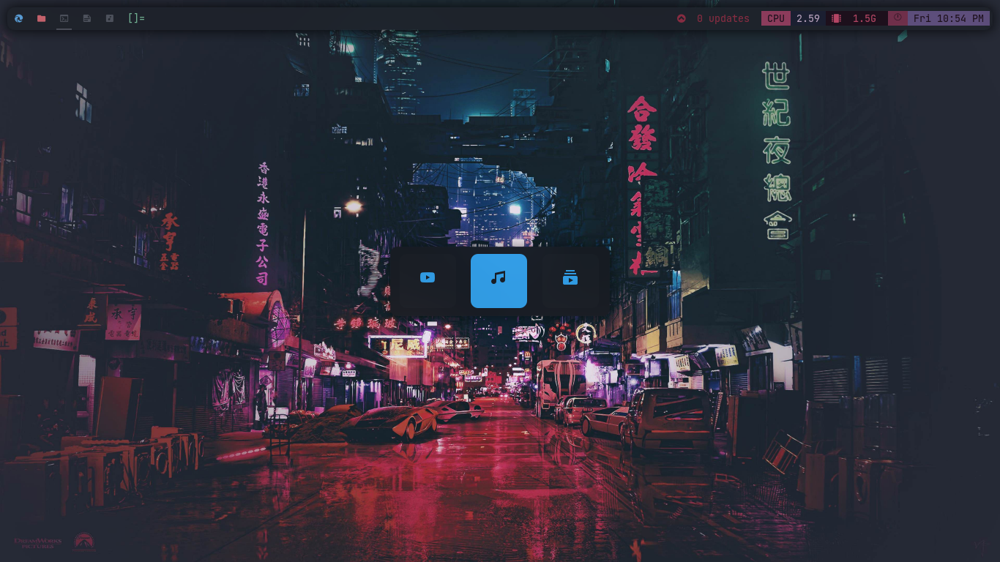
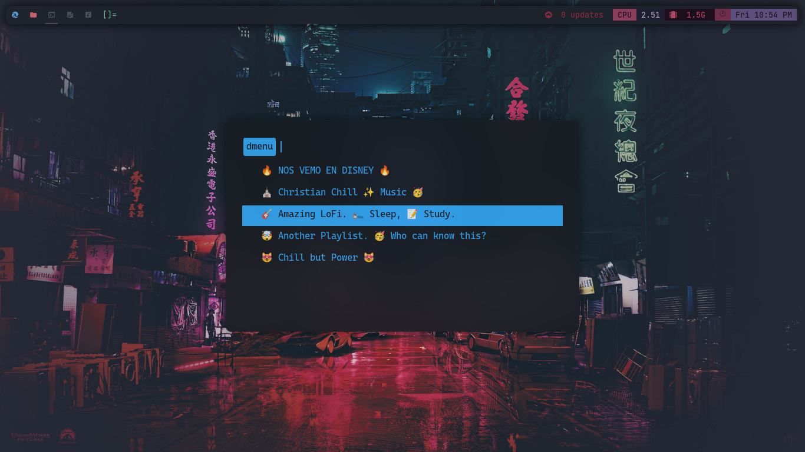
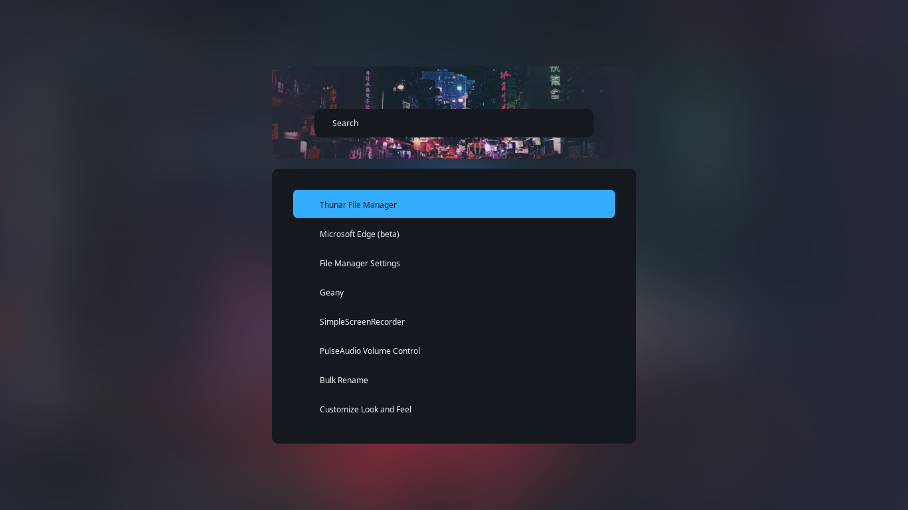
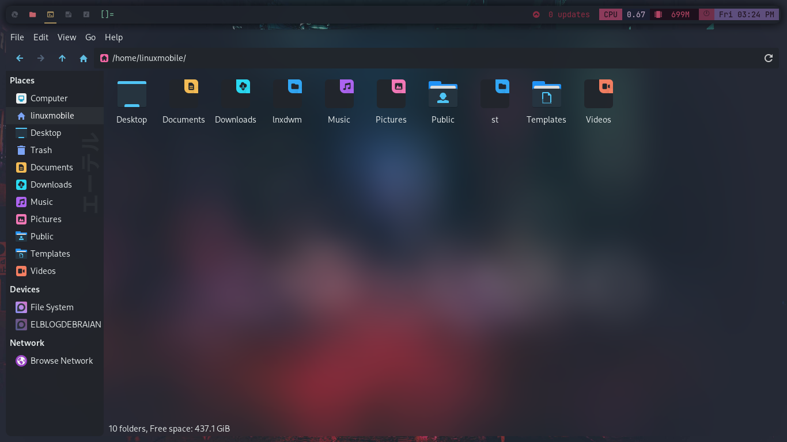
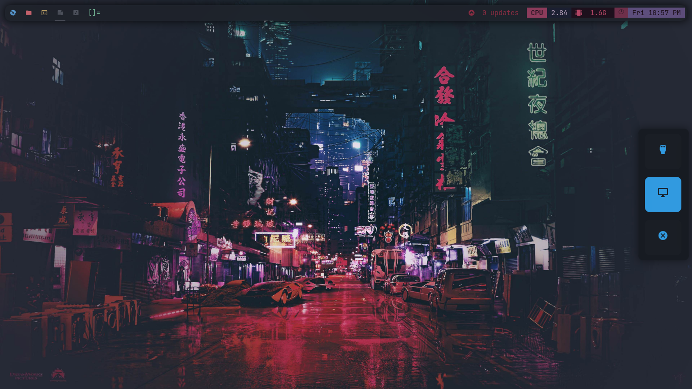
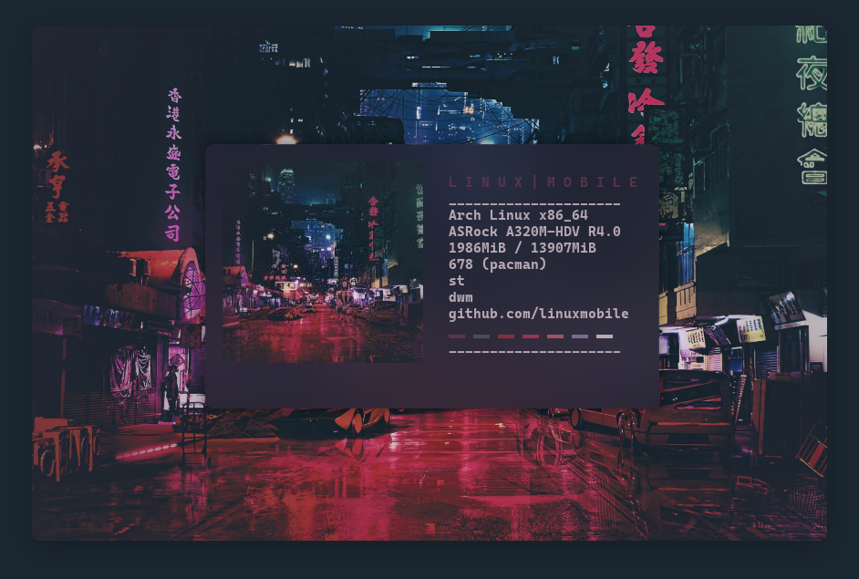
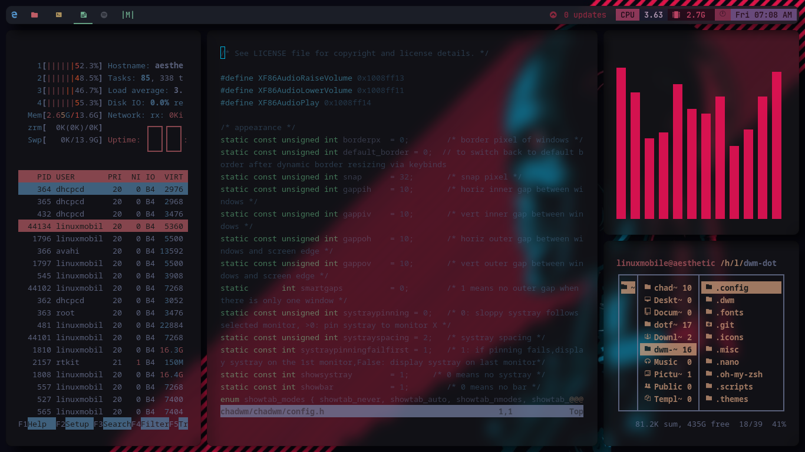

# DWM - DOTS

<h2 align="center"> ━━━━━━  ❖  ━━━━━━ </h2>

<!-- BADGES -->
<div align="center">
    <p></p>
    <a href="https://github.com/linuxmobile/dwm-dots/stargazers">
        
    </a>
    <a href="https://github.com/janleigh/dotfiles/network/members/">
        
    </a>
    
    
</div>

<p/>


---

* **Window Manager** • [DWM ](https://github.com/siduck/chadwm)🎨 Tiles Everywhere!
* **Shell** • [Zsh ](https://www.zsh.org) 🐚 con [oh-my-zsh](https://github.com/ohmyzsh/ohmyzsh) framework!
* **Terminal** • [ST ](https://github.com/siduck/st) 💻 Una terminal muy poderosa y con soporte a imagenes!
* **Panel** • [dwm-bar ](https://github.com/siduck/chadwm)🍧 Sencilla, sin lujos!
* **Compositor** • [Picom ](https://github.com/yshui/picom) 🍩 rounded corners y mucho BLUR!
* **Notify Daemon** • [Dunst ](https://github.com/dunst-project/dunst) 🍃 minimalista!
* **Launcher** • [Rofi ](https://github.com/davatorium/rofi) 🚀 Realmente rápido y customizable!
* **File Manager** • [Ranger ](https://github.com/ranger/ranger)🔖 customizado!
* **GUI Basic-IDE** • [NVIM ](https://github.com/vlagh3/NvChad) 🗒️Un IDE muy hermoso!

## Este es mi actual desktop


## 🌸 Setup

Esto va a ser un intento de un "paso a paso". Pero siempre recomiendo no copiar y pegar al pie de la letra. Sino "inspirarse".  
Como suelen decir en la comunidad de linux. Solamente [R.T.F.M](https://en.wikipedia.org/wiki/RTFM).

### Instalación (dependencias y paquetes)

    Primero que nada un breve "disclaimer". Esta configuración es la que estoy utilizando actualmente. Está pensado para funcionar en Archlinux, y para dejar el escritorio tal cual lo tengo yo. Por lo tanto, si estás utilizando otra distribución vas a tener que instalar las dependencias en base a ello. Así que si no utilizas Archlinux, no te recomiendo copiar y pegar.

#### Instalando Paru como AUR Helper 🆘

```sh
# For Aur Helper install Paru
echo "### Installing paru as AUR Helper"
mkdir $HOME/Downloads/_cloned-repos
cd $HOME/Downloads/_cloned-repos
git clone https://aur.archlinux.org/paru.git
cd paru
makepkg -si  
```

#### Instalamos Oh-My-Zsh 🐚

```sh
# First install Oh-My-Zsh  
echo "### Installing oh-my-zsh"  
sh -c "$(curl -fsSL https://raw.github.com/ohmyzsh/ohmyzsh/master/tools/install.sh)"  
```

#### Instalando los paquetes requeridos 📦

```sh
echo "### Installing Required Packages"
paru -S python ffmpeg pulseaudio pulseaudio-alsa alsa-utils dunst xclip scrot      \
thunar thunar-archive-plugin thunar-volman ffmpegthumbnailer tumbler w3m neovim    \
viewnior mpv htop lxappearance picom-jonaburg-fix rofi rsync pavucontrol farge-git \
ranger python-pip noto-fonts-emoji noto-fonts-cjk python-pillow-git xwallpaper     \
exa bat file-roller geany geany-plugins gvfs gvfs-mtp htop wal-git imlib2          \
xorg-xsetroot simplescreenrecorder ytfzfim cava ps_mem unimatrix xdg-user-dirs     \
ueberzug pacman-contrib catppuccin-gtk-theme fzf imlib2
```

#### Instalamos Oh-My-Zsh Plugins 🔌

```sh 
echo "### Installing Oh-My-Zsh Plugins"
git clone --depth 1 https://github.com/zsh-users/zsh-syntax-highlighting.git ${ZSH_CUSTOM:~/.oh-my-zsh/custom}/plugins/zsh-syntax-highlighting
git clone --depth 1 https://github.com/zsh-users/zsh-autosuggestions.git ${ZSH_CUSTOM:~/.oh-my-zsh/custom}/plugins/zsh-autosuggestions
git clone --depth 1 https://github.com/zsh-users/zsh-completions.git ${ZSH_CUSTOM:~/.oh-my-zsh/custom}/plugins/zsh-completions  
```


#### Ahora procedemos a Clonar y copiar los Dotfiles

_Algunas de las configuraciones que pueden ubicar en mis dotfiles_
<p align="center">
  <a>
    
  </a>
  <a>
    
  </a>
  <a>
    
  </a>
  <a>
    
  </a>
  <a>
  
  </a>
  <a>
  
  </a>
  <a>
  
  </a>
</p>


##### Clonamos y Copiamos

```sh 
git clone https://github.com/linuxmobile/dwm-dots $HOME/dwm-dots/  
cd $HOME/dwm-dots/
rsync -avxHAXP --exclude '.git*' .* ~/  
```

##### Agregamos los iconos

```sh
pushd ~/.icons/ && \
tar -xJf oomox-aesthetic-light.tar.xz && tar -xJf oomox-aesthetic-dark.tar.xz && \
sudo ln -vs ~/.icons/oomox-aesthetic-dark /usr/share/icons/
sudo ln -vs ~/.icons/oomox-aesthetic-light /usr/share/icons/
rm -rf *.tar.xz
popd 
```

##### Por último actualizamos las fuentes

```sh 
fc-cache -rv  
```

    Eso es todo lo necesario. Tal vez necesite ir actualizando este post, ya que siempre es necesario mantener actualizado todo. Quizá faltan cosas, porque me olvidé o por alguna razón. Así que agregaré todo lo necesario con el tiempo.


### Instalamos DWM 🪟

```sh
cd $HOME/dwm-dots/lnxdwm/
sudo make install
```

### ST terminal 🔥
```sh
cd $HOME/st/
sudo make install
```


### Creditos

_A la hermosa comunidad de [r/unixporn](https://www.reddit.com/r/unixporn)._

**©** _A todos los artistas que crearon los iconos, ilustraciones, y wallpapers._

**©** _A cada uno que ha creado y mantiene los proyectos que he mencionado y utilizado anteriormente._

---


© [Owl4ce](https://github.com/owl4ce)
© [Ilham25](https://github.com/ilham25)
© [Siduck](https://github.com/siduck)
© [NvChad](https://github.com/NvChad) 
